# 아스라 (ASRA)

> 희미해진 나라, 사라지지 않은 원한.

조선의 전란기에서 출발해 울릉도·조선·여진·일본을 잇는 브라우저 기반 다크 판타지 액션 RPG입니다. 클릭 이동과 자동 추적 전투, 전리품과 장비 성장의 감각 위에 네 주인공의 이야기, 동행 부대, 세력 전쟁, 월드맵과 장기 던전을 쌓아 올리고 있습니다.


[게임 바로 플레이](https://haze-479ed.web.app/) · [공식 게임 가이드](https://haze-479ed-guide.web.app/) · [본편 안의 가이드](https://haze-479ed.web.app/guide/)

> 아스라는 실제 사건과 인물에서 출발한 대체 역사 판타지이며, 완성된 상용 게임이 아니라 계속 개발 중인 개인 프로젝트입니다.

## 왜 만들었나

어릴 때부터 역사를 좋아했습니다. 교과서에서 몇 줄로 지나가는 전쟁을 그 시대의 산길과 장터, 성문과 피난 행렬 속에서 직접 걸어 보고 싶었습니다.

좋아했던 게임은 리니지와 디아블로였습니다. 특정 설정이나 자산을 옮기려는 것이 아니라, 마을 밖 사냥터로 나설 때의 긴장감, 어렵게 얻은 장비 한 점이 전투를 바꾸는 순간, 위험한 필드와 던전을 지나 더 먼 세계로 나아가는 성장의 리듬을 한국 역사 RPG에서 느껴 보고 싶었습니다.

그리고 혼자 모든 적을 쓰러뜨리고 혼자 성을 차지하는 영웅보다, 농민·의병·패잔병·부족 전사들과 함께 전선을 움직이는 주인공을 만들고 싶었습니다. 병사들과 대규모 전투를 벌이고, 병력과 사기, 점령한 거점과 선택의 결과가 다음 지역에 이어지는 게임이 아스라의 출발점입니다.

## 현재 플레이할 수 있는 것

### 네 주인공, 네 개의 별도 캠페인

- **김동혁 — 울릉의 죄인:** 관청 감옥터에서 탈출해 농민과 의병을 규합하고 조선 본토로 향합니다.
- **하진 — 패전한 여진 활잡이:** 흩어진 세 부족의 맹약을 얻어 통합군을 세우고 압록 전선의 패배를 되갚습니다.
- **연화 — 오사카 포로촌의 조선 무당:** 방울·부적·진혼굿으로 원혼을 다루며 포로촌 생존자들과 귀향길을 엽니다.
- **왕세자 광해 — 분조를 이끄는 사람:** 일곱 고을의 관군과 의병을 수습하고 왕명·백성·왕좌 사이의 갈림길을 선택합니다.

네 주인공의 로컬·클라우드 저장 슬롯은 서로 분리됩니다.

### 필드, 성장, 전쟁

- 조선·울릉도·여진·일본을 연결한 **지상 52개 지역**과 육로·해로 이동
- 바닥 클릭 이동, 대상 추적과 기본 공격, 8방향 걷기·공격 애니메이션
- 전리품, 인벤토리, 장착·해제, 장비 강화, 제작, 무공 성장과 속성 효과
- 농민·의병·패잔병·부족 전사·분조군을 실제 전장에 호출하는 동행 부대
- 거점, 병력, 세력 전황과 주인공의 선택이 저장되는 캠페인 진행
- 농민·상인·피난민·포로·장인·순찰대가 생활하는 마을과 도시
- 층별 절차 생성과 10층 단위 보스 성소를 갖춘 **100층 무영광산**
- 전투·획득·이야기·저장에 영향을 주지 않고 전 세계를 답사하는 **유령 여행 모드**
- 데스크톱과 모바일 HUD, 설치 가능한 PWA, 로컬 우선 저장과 Firestore 동기화

## 온라인 성채

타이틀 화면의 **온라인 성채**에서 접속 이름을 정하고 입장할 수 있습니다. 온라인 기능은 싱글 플레이 캠페인과 분리되어 있습니다.

현재 구현된 온라인 기능은 다음과 같습니다.

- 동시 접속자와 위치를 보여 주는 WebSocket 프레즌스
- 두 명을 매칭하는 실시간 **1:1 대련**
- Firestore 실시간 채팅
- 장비 제안을 등록·예약·해제·취소하는 **거래 제안소**

### 1:1 대련은 서버가 판정합니다

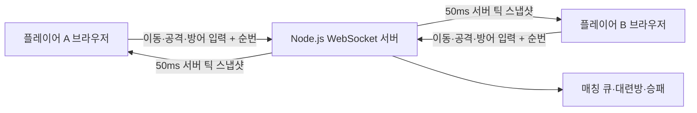

브라우저는 조작 입력만 보내고, 서버가 위치·사거리·공격 재사용 시간·방어·피해·제한 시간·승패를 계산합니다. 서버는 메시지 크기와 정확한 필드 구조를 검사하고, 플레이어별 입력 순번으로 오래되거나 중복된 입력을 거부하며, 초당 메시지 수도 제한합니다. 클라이언트는 서버가 보낸 스냅샷을 화면에 반영합니다.

오픈 월드 프레즌스는 별도의 전투 판정이 아니라, 허용된 지역과 좌표 범위 안에서 다른 접속자의 위치를 공유하는 기능입니다.

### 거래소가 아니라 비구속 거래 제안소입니다

Firestore의 `marketplace_offers`에는 제안과 예약 상태만 기록됩니다. 싱글 플레이의 아이템이나 금화를 읽거나 자동 이전하지 않으며, 예약은 거래 완료나 소유권 이전을 뜻하지 않습니다.

- Firebase 익명 인증 사용자는 Firestore 제안을 등록하고 예약할 수 있습니다.
- 예약·해제·취소는 Firestore 트랜잭션으로 직렬화됩니다.
- 보안 규칙이 판매자·예약자와 허용된 상태 전이, 아이템·가격 범위를 검증합니다.
- 인증을 사용할 수 없으면 온라인 장부를 흉내 내지 않고 해당 기기의 격리된 로컬 데모 장부로 전환합니다.

### Firestore와 Realtime Database 중 무엇을 선택했나

거래 제안소는 문서 조회·필터·상태 전이와 보안 규칙이 중요해 **Firestore**를 선택했습니다. 반면 1:1 결투는 데이터베이스에 피해를 쓰는 구조보다 서버가 사거리·재사용 대기 시간·승패를 직접 판정해야 해 기존 **WebSocket 서버**를 확장했습니다. Realtime Database를 추가해도 결투의 서버 권위 판정을 대체하지 못하므로, 이 단계에서는 중복 인프라를 늘리지 않았습니다.

## 실행

### 요구 환경

- Node.js 22
- npm
- 전체 테스트 실행 시 Python 3와 Pillow

```bash
npm ci
npm run dev
```

Vite가 출력한 로컬 주소를 브라우저에서 열면 됩니다.

### 테스트와 프로덕션 빌드

```bash
python3 -m pip install Pillow
npm test -- --run
npm run build
```

`npm run build`는 게임용 `dist/`와 공식 가이드용 `guide-dist/`를 함께 만듭니다.

### 온라인 서버를 로컬에서 실행하기

별도 터미널에서 다음 명령을 실행합니다.

```bash
cd server
npm ci
npm start
```

게임 클라이언트는 기본적으로 공개 WebSocket 서버에 연결합니다. 로컬 서버를 사용할 때는 Vite 실행 전에 `VITE_MULTIPLAYER_URL=ws://localhost:3000/ws`를 지정합니다.

## 조작법

| 입력 | 동작 |
| --- | --- |
| 바닥 클릭·터치 | 목적지로 이동 |
| 몬스터 클릭·터치 | 대상 선택, 추적, 기본 공격 |
| 전리품 클릭·터치 | 자동 접근 후 습득 |
| `Q` `W` `E` `R` | 주인공·무기별 무공 |
| `Space` | 회피 보법 |
| `2` | 산삼환 사용 |
| `I` | 행낭·장비 |
| `K` | 무공 수련 |
| `J` | 이야기 기록 |
| `M` | 천하 행군도 |
| `Esc` | 열린 창 닫기·일시정지 메뉴 |

모바일에서는 화면의 전용 이동·전투·메뉴 버튼으로 같은 기능을 조작할 수 있습니다.

## 실제 플레이 화면

아래 이미지는 저장소에 포함된 실제 플레이 캡처입니다. 싱글 캠페인·여행 모드와 함께 실제 클라우드 서버에서 진행한 1:1 결투 결과와 Firestore 거래 제안소를 포함합니다.

| 실제 2인 대련 | 서버 판정 결과 | Firestore 거래 제안소 |
| --- | --- | --- |
| 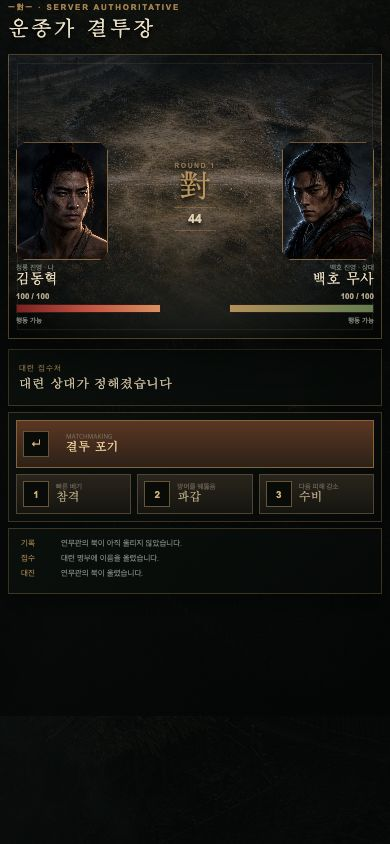 | 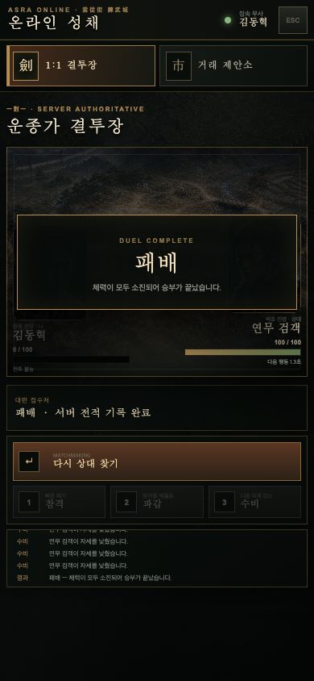 | 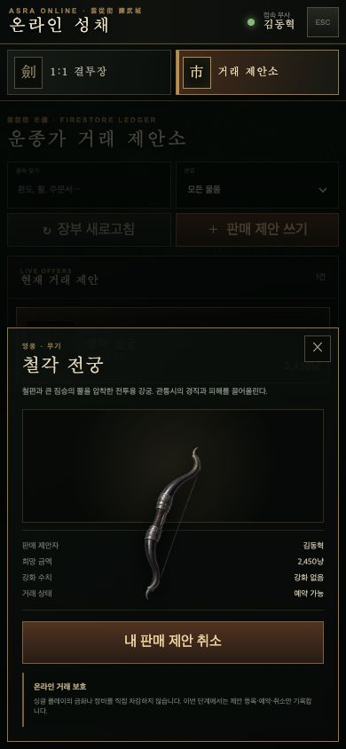 |

| 천하 행군도 | 네 주인공 선택 |
| --- | --- |
| 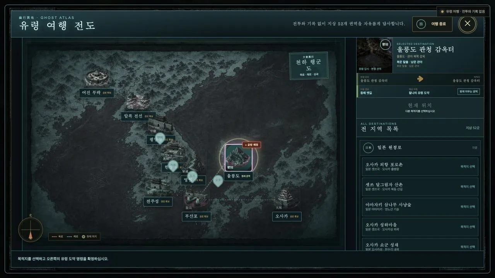 | 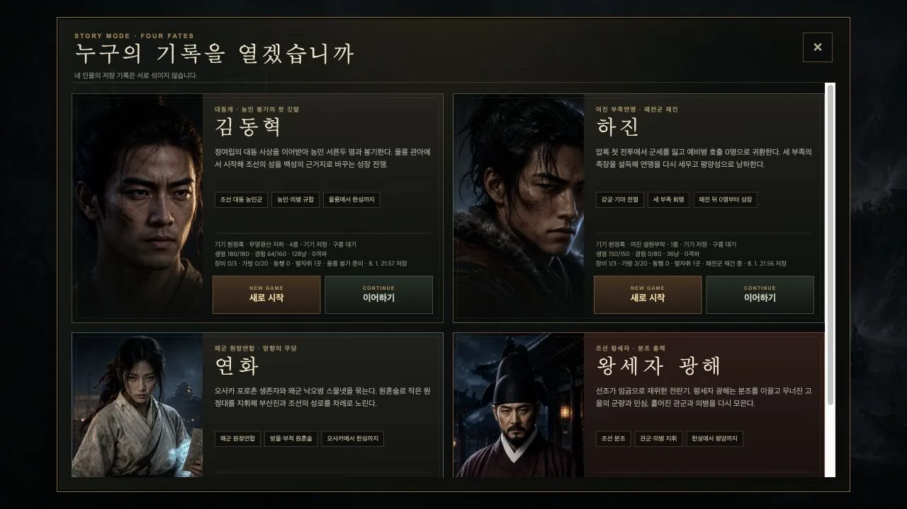 |

| 왕세자 광해의 창덕궁 | 오사카 포로촌의 무당 연화 |
| --- | --- |
| 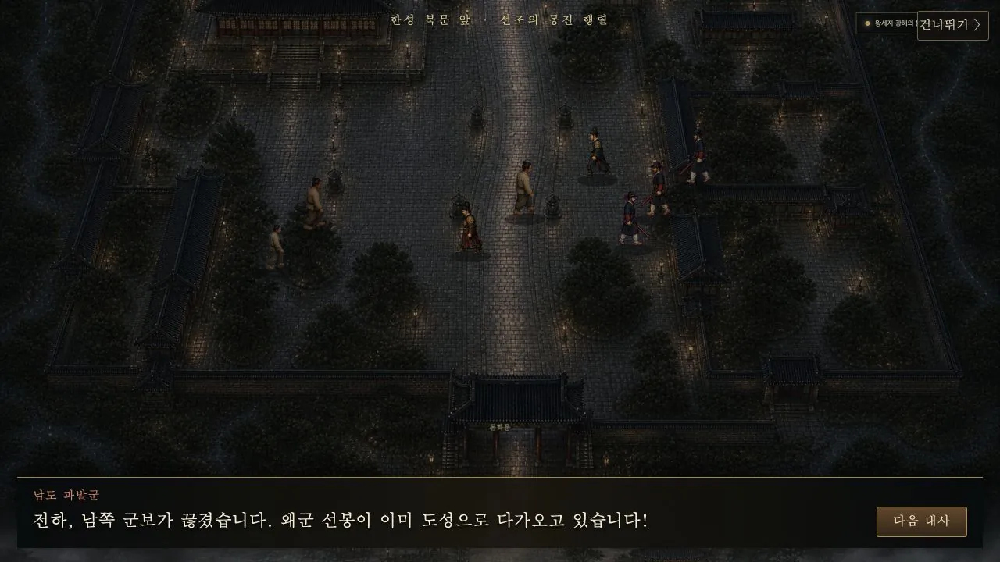 | 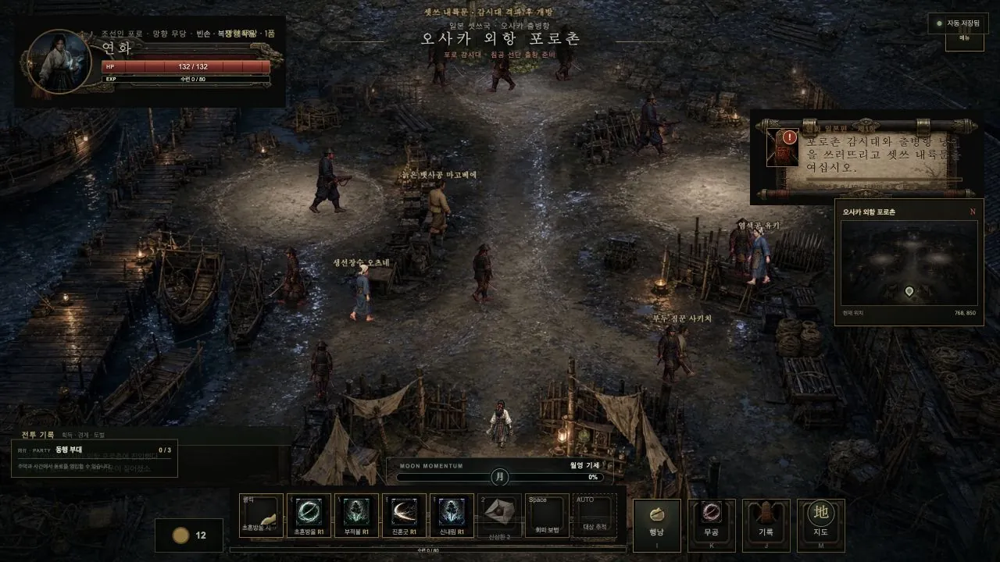 |

| 여진 부족을 규합하는 하진 | 울릉 해송마을 |
| --- | --- |
| 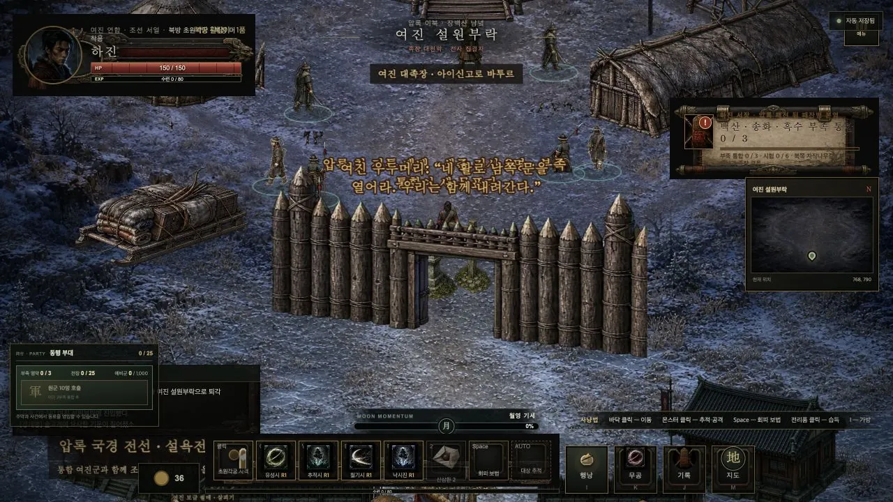 | 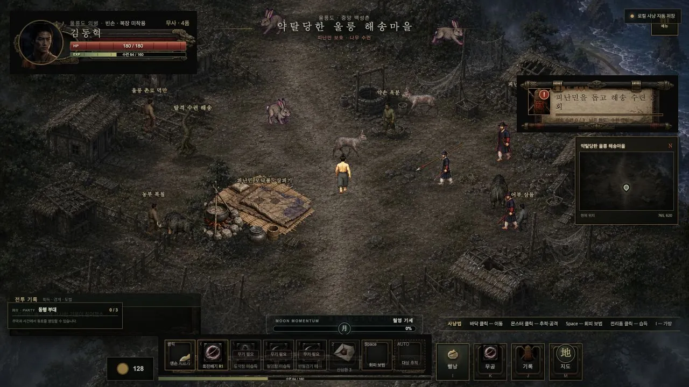 |

| 100층 무영광산 | 타이틀 화면 |
| --- | --- |
| 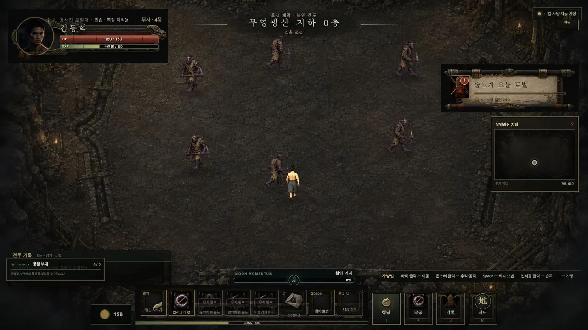 | 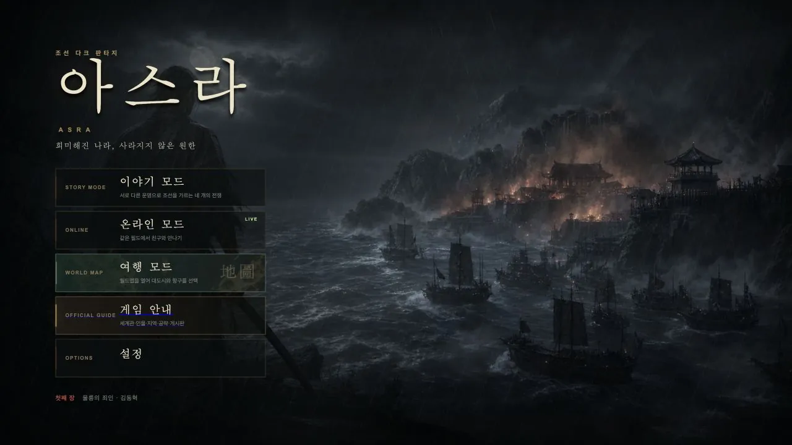 |

## 기술 구성

- **Phaser 3 + TypeScript:** 필드, 전투, 카메라, 애니메이션, 시뮬레이션
- **Vite:** 개발 서버와 프로덕션 빌드
- **Vitest:** 전투, 이동, 저장, 월드, UI 회귀 테스트
- **Node.js + ws:** 온라인 프레즌스와 서버 권위 1:1 대련
- **Firebase Auth + Firestore:** 익명 온라인 식별, 클라우드 저장, 채팅, 거래 제안 장부, 가이드 게시판
- **Firebase Hosting:** 게임과 공식 가이드 배포

캐릭터나 몬스터 스프라이트를 추가·교체할 때는 [`docs/SPRITE_MODELING_GUIDE.md`](docs/SPRITE_MODELING_GUIDE.md)의 방향, 프레임 크기, 발 기준점, 걷기·공격 액션 규격을 따릅니다.

## 프로젝트 상태

아스라는 한 개의 클릭 사냥터에서 시작해 네 주인공, 지상 52개 지역, 세력 전쟁, 100층 던전과 온라인 성채를 가진 세계로 확장되었습니다. 아직 목표한 대규모 전쟁의 완성형은 아닙니다. 부대 대형과 지휘 명령, 사기와 보급, 공성전, 점령 결과에 따라 달라지는 도시를 차근차근 더해 가고 있습니다.

## 이용 범위

소스 코드와 이미지 자산은 포트폴리오 공개용입니다. 별도 허락 없이 게임·자산을 복제하거나 재배포할 수 없습니다. Copyright © 2026 donghyuk0605. All rights reserved.
